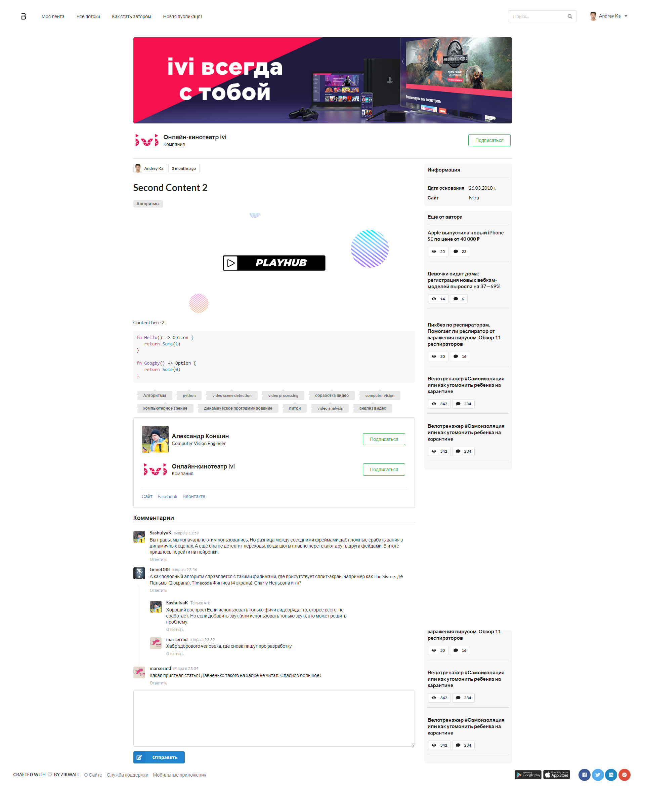
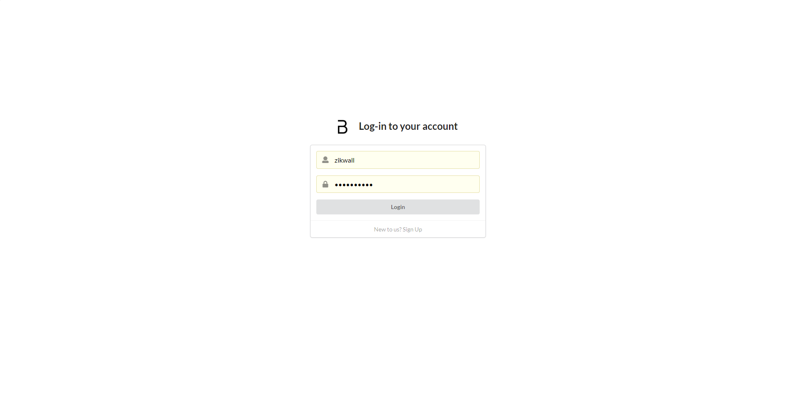
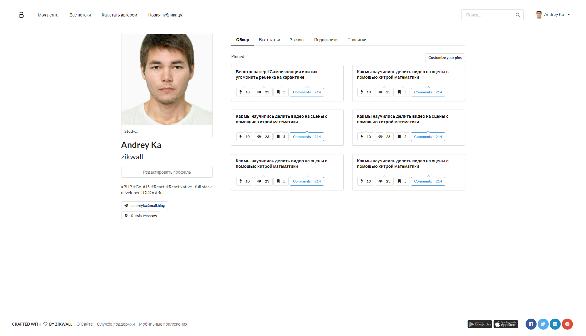
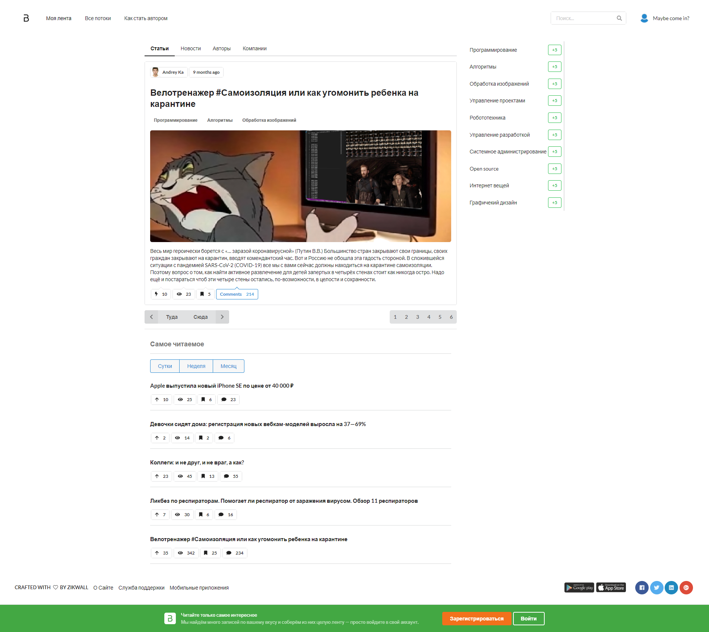
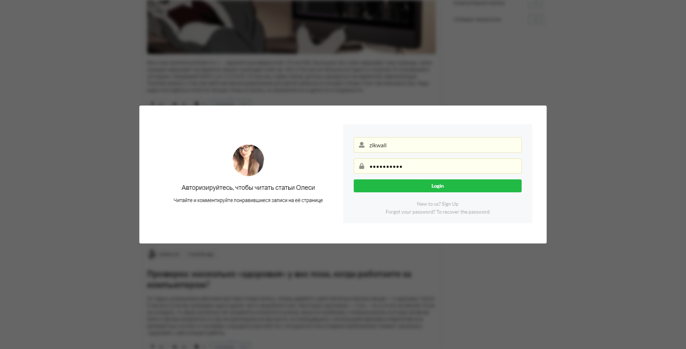
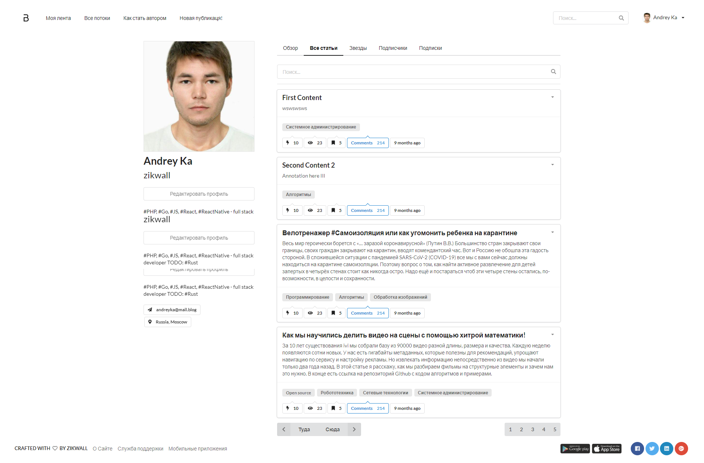
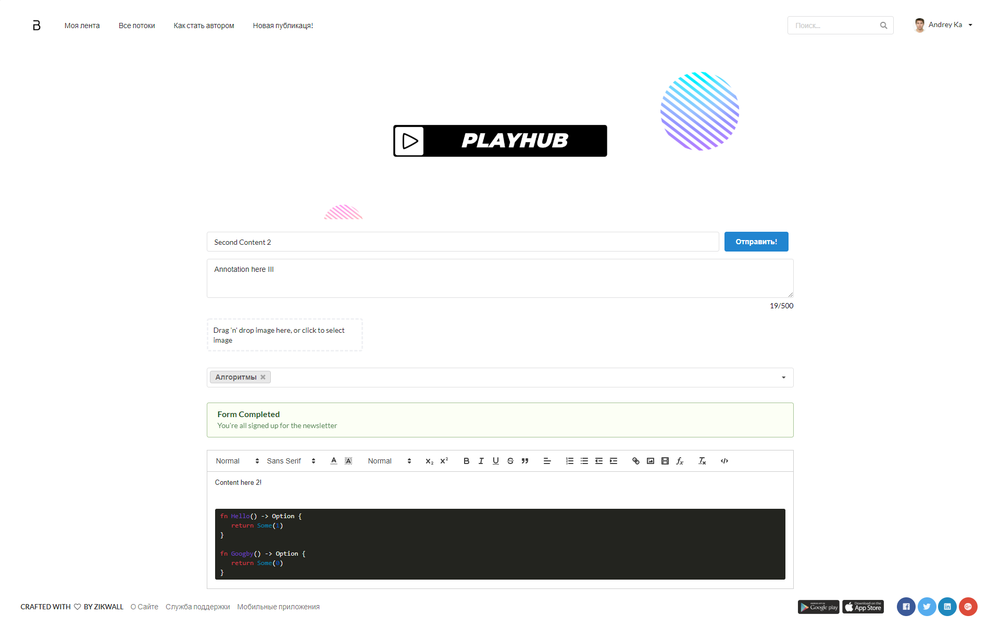

  
  <h1>Blogсhain</h1>
  <h5>Blogchain is an isomorphic web application for organizing a network of blogs. Includes several repositories in different languages.</h5>

### Client

- [x] [Next.js](https://github.com/zikwall/blogchain)
- [ ] [Svelte](https://github.com/zikwall/blogchain-svelte)

### Backend-s:

- [x] [Go](https://github.com/zikwall/blogchain-go)
- [ ] [Rust](https://github.com/zikwall/blogchain-rust)
- [ ] PHP
- [ ] Node.js (Express, Polka - self server)

### Welcome

http://mediafanbox.online:3000/

**Example user**

- Login: zikwall
- Password: prizrak211

### Todo

- [x] Custom Blogchain HTTP client
- [x] Automatically HTTP error handling with use native http codes
- [x] UI component collection
- [x] Authorization\Auntification support: client side & server side based on JWT
- [x] Custom app X-Header(s)
- [ ] Support SEO
    - [x] Title
    - [ ] Description
    - [ ] Other meta tags
- [x] Active Links support by href (or asHref)
- [x] Feeds | Index | Home (WIP)
    - [x] Pagination
- [x] Post | Posts | Tags
    - [x] Support WYSIWYG editor based on Quill: todo emoji
    - [x] Create\Update\View content
    - [ ] Delete content
    - [ ] Content
    - [x] TimeAgo
    - [x] Author info
    - [x] Image
    - [x] Annotation
    - [ ] Company Heading (if company exist)
    - [ ] Company info (if exist)
    - [ ] Comments
    - [x] Tags
    - [ ] Labels
    - [ ] Actions
    - [ ] Stats: views, rating, bookmarks
- [ ] Top
    - [ ] Most Popular
    - [ ] Month | Week | Day
- [ ] Publisher related items
- [ ] News
- [ ] Authors
- [ ] Companies
- [x] Login
- [ ] Registration
- [ ] Forgot password
- [ ] Profile
    - [ ] Overview
        - [x] Information: Avatar, Location & etc.
        - [ ] Pinned items
        - [ ] Activity
    - [x] All items
    - [ ] Stars
    - [ ] Following
    - [ ] Followers
- [ ] Settings
    - [ ] Security
    - [ ] Profile edit
- [ ] Global search

### Run dev

1. Use one of backend apps, example Go: `go run .`
2. `yarn dev`

### Preview

Posts | Login | Error pages | Profile
--- | --- | --- | ---
 |  |  | 
 |  | - | 
 | - | - | -
